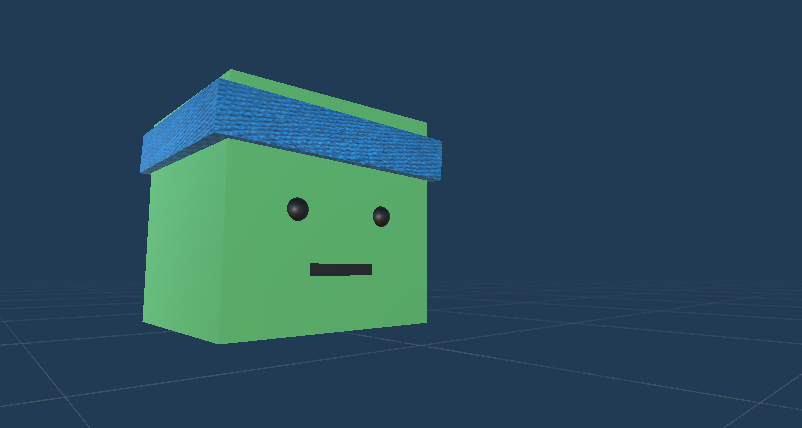
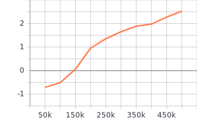
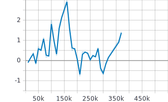
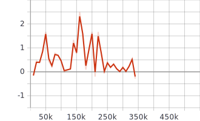
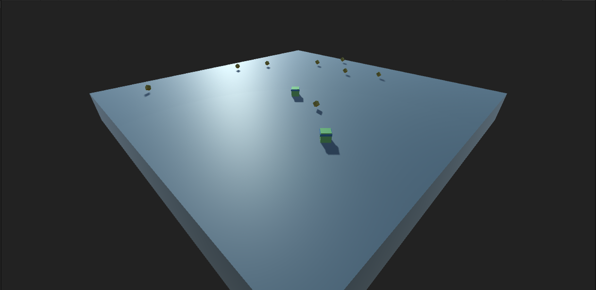
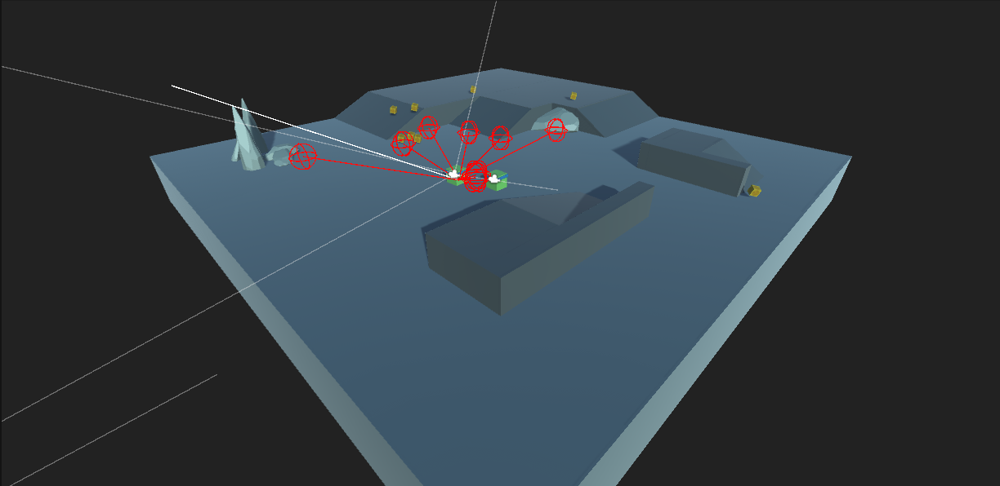
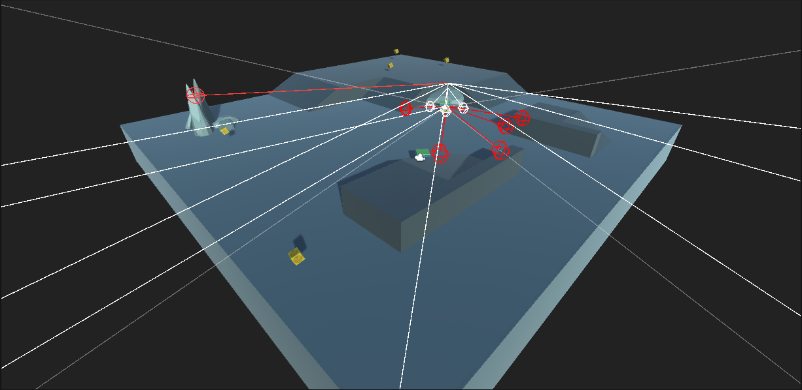

# Summary

## Requirements
This project was completed for the course CS-4430, Maching Learning & Intelligent Agents at Cedarville University (c). This is assigment is Project #3 for Spring 2021, *Train a Neural Network with Reinforcement Learning.* In this project we were to train a Neural Network with Reinforcement Learning to move the agent towards a set of collectables found on a given scene. The training was to be done useing ML-Agents ([release 12](https://github.com/Unity-Technologies/ml-agents/tree/release_12_docs)) in Unity. We were to have at least one complex Unity scene containing scenery elements, obstacles, and collectables. Both the agent and the collectables for each episode were to be randomly distributed on the map.

## Credits
This project makes ust of the [ML-Agents](https://github.com/Unity-Technologies/ml-agents) Git Repository. Additional dependencies include Python 3.7|3.8 and [pytorch](https://pytorch.org/).

# Design
Three Agents were trained across two Scenes. One scene was left flat and empty to work as a framework; the second scene includes platforms, ramps, rocks, and walls.

## Agents

    
    

    The following details describe the Agent <i>at time of training.</i> "Optimal State" is true when all collectables are collected. There are three trained brains, each belonging to the respectively named Agents (i.e. the <i>Collector_Agent</i> brain belongs to the Collector_Agent prefab; the <i>ImprovedAgent</i> brain belongs to the ImprovedAgent prefab; and the <i>ImprovedAgent2.0</i> brain belongs to the ImprovedAgent2.0 prefab).
    

### **Collector_Agent**
| Number of Agents | Script Used        | Reward Function                   | Behavior Parameters         |
| ---------------- | ------------------ | --------------------------------- | --------------------------- |
| 1                | Collector_Agent.cs | -0.005f at each step              | Name: *CollectingCube*      |
|                  |                    | -1.0f when agent falls            | Vector Observation Space: 5 |
|                  |                    | +0.3f at Raycast hitting obstacle | Actions: *3 continuous*     |
|                  |                    | +0.5f on trigger with collectable | Discrete Branches: *0*      |
|                  |                    | +1.0f at optimal state            |                             |

| Number of Ray Sensors | Rays / Direction | Ray Degrees | Sphere Cast Radius | Ray Length | Start Vertical Offset | End Vertical Offset |
| --------------------- | ---------------- | ----------- | ------------------ | ---------- | --------------------- | ------------------- |
| 1                     | 4                | 180         | 2                  | 50         | 0                     | 0                   |

| Number of steps taken | Final Mean Reward | Time to Run | Turn Speed | Move Speed |
| --------------------- | ----------------- | ----------- | ---------- | ---------- |
| 500,000 steps         | 2.557f            | 1h 56m 27s  | 300        | 2          |
 

### **ImprovedAgent**
| Number of Agents | Script Used      | Reward Function                                                   | Behavior Parameters         |
| ---------------- | ---------------- | ----------------------------------------------------------------- | --------------------------- |
| 1                | ImprovedAgent.cs | -1.0f when agent falls                                            | Name: *CollectingCube*      |
|                  |                  | +(1-(`num_left`/`num_collectables`))f on trigger with collectable | Vector Observation Space: 4 |
|                  |                  | +1.0f at optimal state                                            | Actions: *3 continuous*     |
|                  |                  |                                                                   | Discrete Branches: *0*      |

| Number of Ray Sensors | Rays / Direction | Ray Degrees | Sphere Cast Radius | Ray Length | Start Vertical Offset | End Vertical Offset |
| --------------------- | ---------------- | ----------- | ------------------ | ---------- | --------------------- | ------------------- |
| 1                     | 4                | 70          | 1                  | 50         | 0                     | 0                   |

| Number of steps taken | Final Mean Reward | Time to Run | Turn Speed | Move Speed |
| --------------------- | ----------------- | ----------- | ---------- | ---------- |
| 370,000 steps         | 1.372f            | 1h 22m 15s  | 200        | 2          |
 

### **ImprovedAgent2.0**
| Number of Agents | Script Used      | Reward Function                                                   | Behavior Parameters         |
| ---------------- | ---------------- | ----------------------------------------------------------------- | --------------------------- |
| 1                | ImprovedAgent.cs | -1.0f when agent falls                                            | Name: *CollectingCube*      |
|                  |                  | +(1-(`num_left`/`num_collectables`))f on trigger with collectable | Vector Observation Space: 4 |
|                  |                  | +1.0f at optimal state                                            | Actions: *3 continuous*     |
|                  |                  |                                                                   | Discrete Branches: *0*      |

| Number of Ray Sensors | Rays / Direction | Ray Degrees | Sphere Cast Radius | Ray Length | Start Vertical Offset | End Vertical Offset |
| --------------------- | ---------------- | ----------- | ------------------ | ---------- | --------------------- | ------------------- |
| 3                     | 3                | 70          | 0.75               | 50         | 0                     | 0                   |
|                       | 3                | 70          | 0.75               | 50         | 2.5                   | 2.5                 |
|                       | 3                | 70          | 0.4                | 2          | 2                     | 0                   |

| Number of steps taken | Final Mean Reward | Time to Run | Turn Speed | Move Speed |
| --------------------- | ----------------- | ----------- | ---------- | ---------- |
| 340,000 steps         | -0.286f           | 1h 50m 03s  | 200        | 2          |
 

## Training Results
 
The following graphs depict the average reward (y-axis) per episode (x-axis). The orange line represents the Collector_Agent's training, the blue line represents the ImprovedAgent's training, and the red line represents the ImprovedAgent2.0's training.
  

    
    
    

# Flat Scene Observations
Each of the following scenes can be found and run from `Assets > Scenes > Flat Scenes`. More scenes comparing different agents against eachother on this map can be found in this directory as well. In the following sections, I have included my observations from watching the scene listed.

## 2_Collector_Agents

    

Each agent moves relatively slowly, especially they do not see anything. The Collector_Agent moves towards the collectables reasonably okay-ish, but it certainly does not chase after them very well. Performance of these agents is bad.

## 2_ImprovedAgents

    

Each agent spins constantly to look for new collectables. They tend to actually find the collectables and chase after them. The agents did not learn to stay on the platform super well. This is not to say that they always just fall off the edge, but they are not awesome at staying on all the time. I would call the agents' performaance adequate to good.

## 2_ImprovedAgent2.0s

    

Each agent spins constantly to look for new collectables. Each agent also works pretty well at finding the collectables and at staying ontop of the platform, although sometimes it will get excited when it finds a collectable, speeds up, and throws itself off the edge. I would call the agents' perforances good to pretty good.

# Leveled Scene Observations
Each of the following scenes can be found and run from `Assets > Scenes > Leveled Scenes`. More scenes comparing different agents against eachother on this map can be found in this directory as well. In the following sections, I have included my observations from watching the scene listed.

## 2_ImprovedAgents

    

Each agent spins constantly to look for new collectables. As in the flat map, the agents are not skilled in staying on the map, however, they do seem to do well in locating collectables and moving in the direction of them. The rotations of the agents appear to sometimes be logical, but for the most part, they just spin in random directions to look for the colectables.

## 2_ImprovedAgent2.0s

    

Each agent spins constantly to look for new collectables, as they did in the flat scene. However, the agents are not prone to look for collectables as much in this scene. They tend to stagnate in the middle for a while, but will sometimes eventually investigate the map further. The agents tend not to go up the ramps, but will sometimes.
